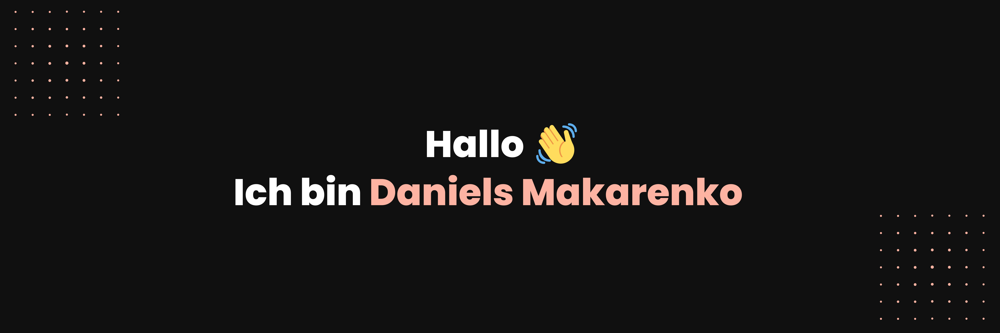

)

#### [Deutsche Version](https://github.com/danielsmak/danielsmak/blob/main/readme.md) / / [Nederlandse versie](https://github.com/danielsmak/danielsmak/blob/main/danielsmakarenko_nl.md) / [Русская версия](https://github.com/danielsmak/danielsmak/blob/main/danielsmakarenko_ru.md)

## About me

Hello 👋, I'm Daniels Makarenko, a frontend developer and UX/UI designer from Düsseldorf.

My colleagues appreciate me as a competent and reliable team player with a great passion for frontend development and UX/UI design. I also bring experience and knowledge in the field of ERP/CRM and web marketing, making me a versatile specialist with a primary focus on frontend development.

## Frontend skills

- JavaScript / ES6
- React.js
- Next.js 12, 13 (Basic skills)
- CSS3/SCSS/JSS
- MUI5 / Tailwind
- GIT

## UX / UI Design skills

- Figma
- Maze
- UX-Research 
- Userflows / Flowcharts
- UI-Prototyping
- User Testing

## ERP / CRM / Marketing Tools

- Microsoft Dynamics 365 CRM 
- ERP SelectLine Warenwirtschaft 
- Contentful
- ClickDimensions 
- Inxmail
- PIWIK PRO 
- Vercel Analytics 
- Google Analytics  (Basic skills)

## Contact me

- My own website/portfolio: [danielsmakarenko.com](https://www.daniels-makarenko.com/ "danielsmakarenko.com") 
- Schedule an appointment on Calendly: [Gespräch vereinbaren](https://calendly.com/danielsmakarenko/ "Schedule an appointment")
- If you are a recruiter or HR specialist, please contact me at: [job@danielsmakarenko.com](mailto:job@danielsmakarenko.com)
- If you need a freelancer or want to collaborate on a project with my assistance, please contact me at: [work@danielsmakarenko.com](mailto:work@danielsmakarenko.com)