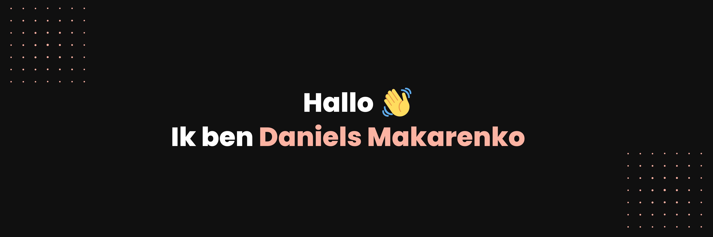

)

#### [English version](https://github.com/danielsmak/danielsmak/blob/main/danielsmakarenko_en.md) / [Deutsche Version](https://github.com/danielsmak/danielsmak/blob/main/README.md) / [Русская версия](https://github.com/danielsmak/danielsmak/blob/main/danielsmakarenko_ru.md)

## Over mij

Hallo 👋, ik ben Daniels Makarenko, een frontend ontwikkelaar en UX/UI ontwerper uit Düsseldorf.

Mijn collega's waarderen mij als een bekwame en betrouwbare teamspeler met een grote passie voor frontend ontwikkeling en UX/UI ontwerp. Ik breng ook ervaring en kennis mee op het gebied van ERP/CRM en webmarketing, wat mij een veelzijdige specialist maakt met een primaire focus op frontend ontwikkeling.

## Frontend vaardigheden

- JavaScript / ES6
- React.js
- Next.js 12, 13 (Basisvaardigheden)
- CSS3/SCSS/JSS
- MUI5 / Tailwind
- GIT

## UX / UI Design vaardigheden

- Figma
- Maze
- UX-Research 
- Userflows / Flowcharts
- UI-Prototyping
- User Testing

## ERP / CRM / Marketing Tools

- Microsoft Dynamics 365 CRM 
- ERP SelectLine Warenwirtschaft 
- Contentful
- ClickDimensions 
- Inxmail
- PIWIK PRO 
- Vercel Analytics 
- Google Analytics  (Basisvaardigheden)

## Neem contact op

- Mijn eigen website/portfolio: [danielsmakarenko.com](https://www.daniels-makarenko.com/ "danielsmakarenko.com") 
- Plan een online afspraak in op Calendly: [Plan een online afspraak](https://calendly.com/danielsmakarenko/ "Plan een online afspraak")
- Als je een recruiter of HR-specialist bent, neem dan contact met me op via: [job@danielsmakarenko.com](mailto:job@danielsmakarenko.com)
- Als je een freelancer nodig hebt of wilt samenwerken aan een project met mijn hulp, neem dan contact met me op via: [work@danielsmakarenko.com](mailto:work@danielsmakarenko.com)